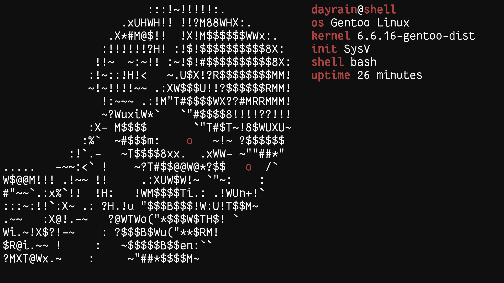

### Installation
```
git clone https://github.com/d4yr41n/dayfetch.git
cd dayfetch
cp dayfetch ~/.local/bin
mkdir -p ~/.local/share/dayfetch
cp -r animations/* ~/.local/share/dayfetch
```

### Usage
```
dayfetch
```

### Animations
- moon
- face
- earth
- bunny
- skull

### TODO
- [ ] sixel support
- [ ] install script
- [ ] animation generator


